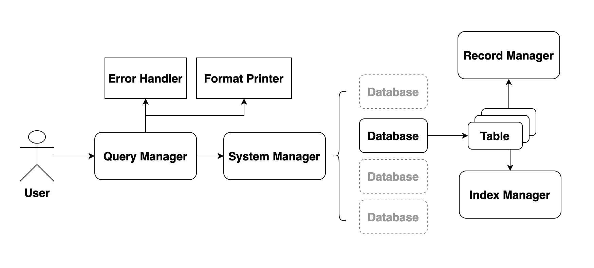
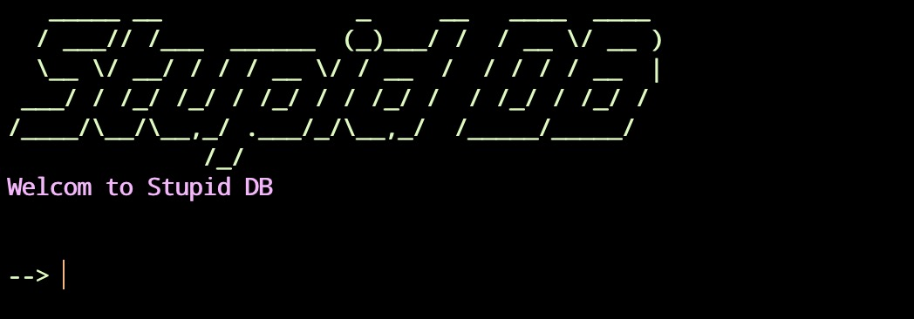
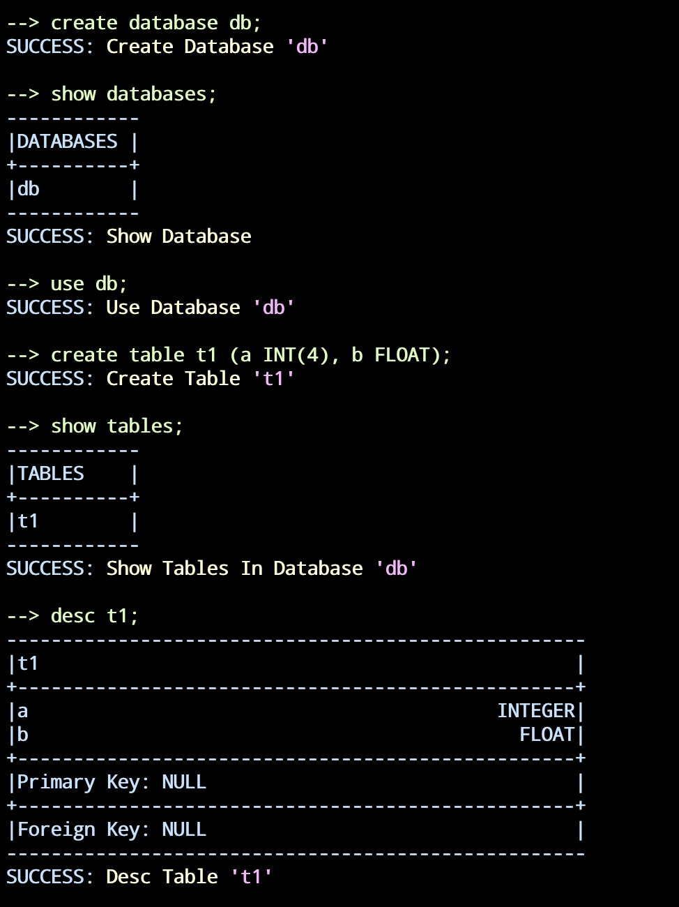
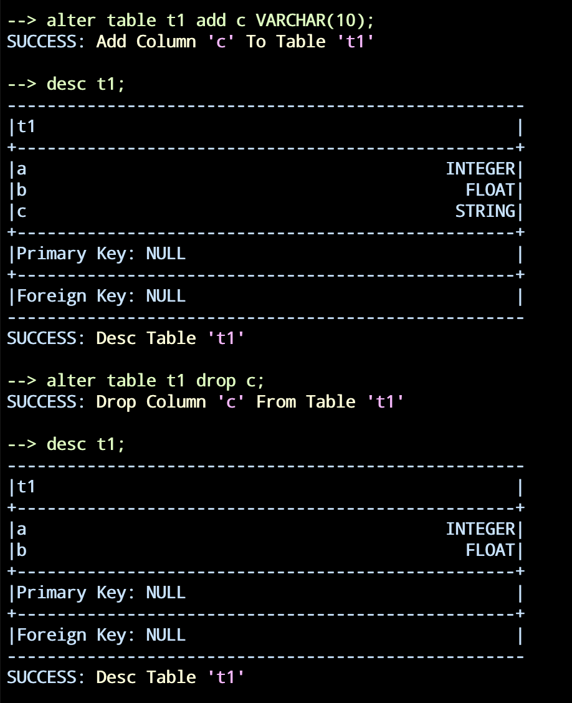
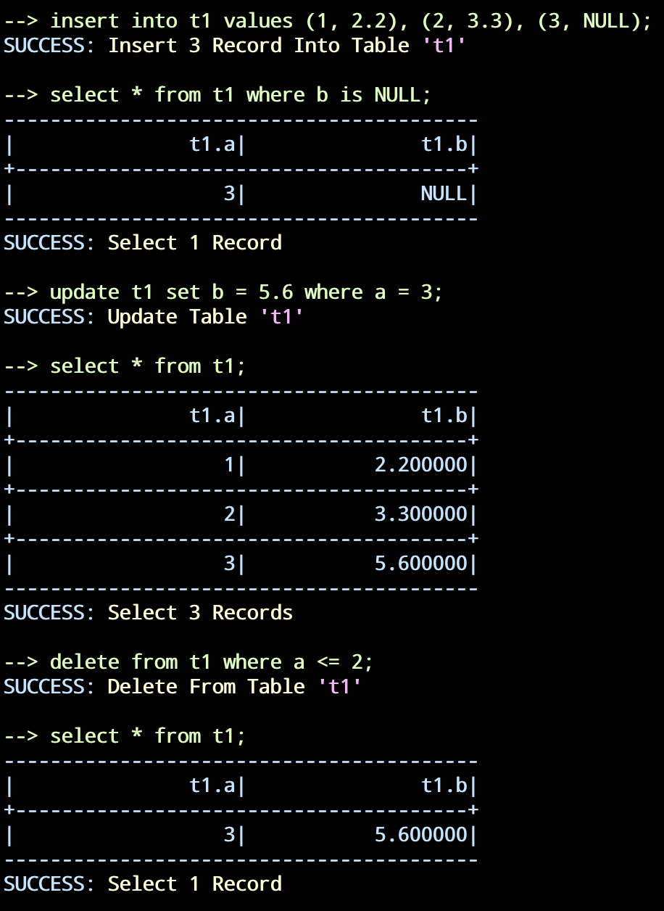
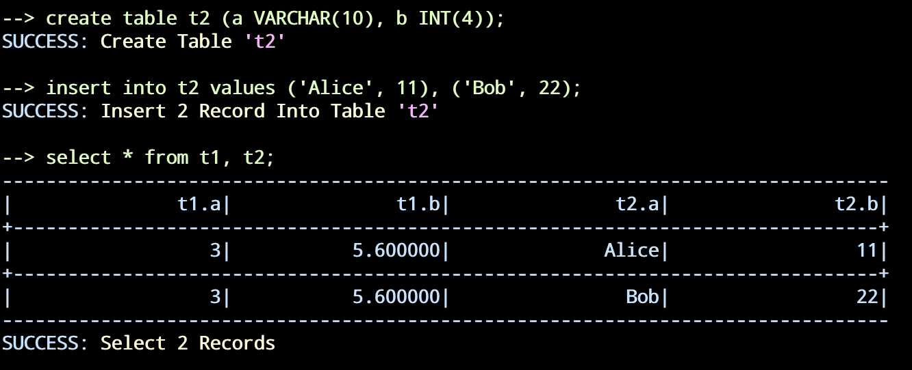
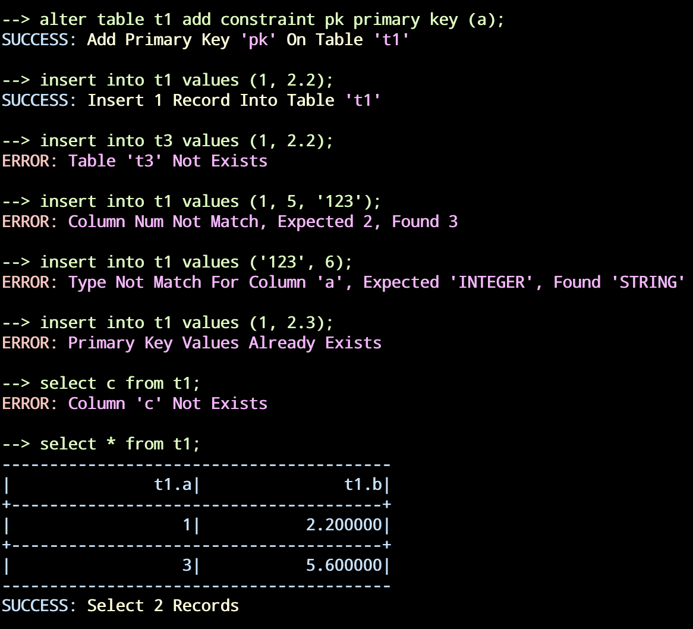

## 数据库系统概论报告

2017011462 方言

本项目完全由单人完成

Github: <a> https://github.com/Suffoquer-fang/StupidDB </a>

### 1. 系统架构设计



### 2. 基础模块

#### 2.1 文件系统 (File System)
这部分修改了`hash`策略（原本的`fileID + pageID`在同时管理多文件时太容易发生冲突），使得可以比较好的同时管理多个文件。


#### 2.2 记录管理模块（Record Manager）

实现了完整的记录管理模块的功能。

这部分设计如下：

* 使用一个单独的文件作为记录文件，文件的第一页用于储存一些额外的信息，如空闲页面，页内偏移量等等。

* 每一页的开头储存当页的一些必要信息，使用`bitmap`记录当前页面内空闲的槽位。其余空间用于储存`Record`内容。

* 每个`Record`对应唯一标识`RID`，由文件页号`pageID`和页内的偏移量`slotID`组成。

每次插入时，通过第一页的信息即可找到一个有空闲槽位的页面，再通过页头的`bitmap`可快速确定偏移量，之后将对应记录写入。

为了保证寻找空闲页面的效率，将所有空闲页面组织成链表管理。每次插入记录占满一页时，将其移除链表，并将构造新的页面加入链表。而删除记录导致页面空闲时，也将其重新加入链表。

#### 2.3 索引管理模块（Index Manager）

基于B+树实现了完整的索引管理模块的功能。

这部分设计如下：

* 使用一个单独的文件作为索引文件，文件的第一页用于储存一些额外的信息，如字段的类型和长度等等。

* 以B+树的形式组织文件的页面，每一个页面作为一个节点。页头记录一些必要信息。

* 以非簇集索引方式构建，这样使得索引模块与记录模块是分离的。

* 对于重复`key`值，`redbase`上的做法是采用`bucket`页作为溢出页，储存某一个`key`对应的所有`RID`。这样保证叶子节点中的`key`是不重复的，但是空间效率低下（`bucket`页很可能只有少部分空间被使用，造成大量浪费），因此我允许重复`key`值在节点中出现，并且稍微修改了`delete`和`search`的逻辑。在叶子节点记录了指向兄弟节点的指针，因此如果要`delete`（或`search`）某个`key-RID`对应的`entry`，我的做法会找寻该`key`值出现的第一个叶子节点，之后通过兄弟节点指针依次遍历，这样可以找到这个`key`对应的所有`RID`。而`redbase`的做法会跳转到该`key`值对应的`bucket`页，之后在bucket页内进行遍历查找RID。因此我的做法时间效率和`redbase`相当，但空间效率会高很多。

* 对于联合索引，只需要在计算长度时将每个字段长度求和，比较两个`key`时，根据多个字段的优先级比较即可实现。

#### 2.4 输出模块

实现了一个`FormatPrinter`负责全系统各个位置的输出信息，报错信息，调试信息等等。

采用全局单例方式实现，可以支持不同颜色，不同对齐方式，不同对齐长度的输出。

经过简单配置，就可以实现将信息输出到log日志的功能，便于排查问题。

#### 2.5 错误处理模块

实现了一个`ErrorHandler`负责全系统各个部分的错误处理。

采用全局单例方式实现，储存一个`error_code`以及必要的错误信息，在系统任意位置可以调用相应方法设置`error_code`和错误信息的参数，`to_string`方法可以将其整合为一条完整的输出信息。配合`FormatPrinter`输出到终端。

### 3. 上层模块

#### 3.1 数据表模块 (Table)

Table模块负责对单个数据表进行管理。

* 数据方面：支持对单个表内的插入，删除，更新和查询功能

* 结构方面：支持创建、删除索引，添加、删除主键，(由于外键涉及多个表，所以放在系统管理模块中实现)，支持字段的添加，删除，修改。

插入和更新时，会检查相应插入数据的类型和长度，以及是否存在主键冲突问题。（外键冲突在系统管理模块中处理）

查询时，根据查询条件寻找第一个能够使用索引的字段，根据索引取回一系列`Record`，再使用其他查询条件做筛选。

字段信息发生改变时，由于涉及到`Record Size`的改变，所以对应的`RID`也会改变，因此所有索引会失效，需要重新构建。

#### 3.2 系统管理模块

系统管理模块处理单个数据库内的每一条指令的执行。

* 数据方面：支持对某个表内的插入，删除，更新和查询功能

* 结构方面：支持创建表，删除表。支持对某个表创建、删除外键。

* 系统方面：支持将数据库的信息dump到`meta`文件中，下一次打开数据库时读取。


#### 3.3 查询解析模块

查询解析模块配合`flex & bison`实现词法和语法解析，以及调用相应的方法执行每一条指令。

大部分的输出全部都由`QL`模块和`FormatPrinter`完成。


### 4. 主要接口说明

#### 4.1 FormatPrinter
```c++
class FormatPrinter {
    static FormatPrinter& instance();
    //获取单例
    static void printWelcome();
    //输出欢迎信息

    //对应配置输出
    void printHeaderLine();
    void printMidLine();
    void printString();

    //设置输出颜色
    static void red();
    static void green();
    static void blue();
    static void purple();


    static void printError();
    //输出错误信息

    static void endline();
    //换行，输出行头的箭头

};
```
#### 4.2 ErrorHandler
```c++
class ErrorHandler {
    static ErrorHandler& instance();
    //获取单例
    void set_error_code(RC error);
    //设置错误的Error Code
    void push_arg(const string &arg);
    //添加一个参数信息
    string to_string();
    //根据参数列表和Error Code，生成对应报错信息的string
};
```
#### 4.3 RecordManager
```c++
class RM_RecordManager {
    bool createFile();
    //创建对应文件
    bool destroyFile();
    //删除对应文件
    bool openFile();
    //打开对应文件
    bool closeFile();
    //关闭对应文件
    RM_FileHandle* getFileHandle();
    //根据对应fileID返回一个FileHandle
};
class RM_FileHandle {
    bool getRecord();
    //根据RID获取对应Record
    bool insertRecord();
    //插入一条Record，返回RID
    bool deleteRecord();
    //根据RID删除一条Record
    bool updateRecord();
    //根据RID更新一条Record
    void updateFileConfig();
    //更新对应Config内容
};
class RM_FileScan {
    bool OpenScan();
    //打开Scan，设置FileHandle和对应条件
    bool next();
    //取回下一条符合条件的Record
    bool satisfy();
    //判断当前Record是否满足条件
};
```
#### 4.4 IndexManager
```c++
class IX_IndexManager {
    bool createIndex();
    //创建索引文件并初始化
    bool destroyIndex();
    //删除索引文件
    bool openIndex();
    //打开索引文件
    bool closeIndex();
    //关闭索引文件
    IX_IndexHandle* getIndexHandle();
    //根据fileID返回一个对应的IndexHandle
};

class IX_IndexHandle {
    bool insertEntry();
    //插入一个Entry
    bool deleteEntry();
    //删除对应Entry
    bool searchFirstEntry();
    //找到对应key值的第一个Entry
    bool searchLastEntry();
    //找到对应key值的最后一个Entry
    bool checkEntryExist();
    //返回对应key值的Entry是否存在
    void getFirstEntry();
    //找到B+树内第一个Entry
};

class IX_IndexScan {
    bool openScan();
    //打开Scan，设置IndexHandle和对应条件
    bool satisfy();
    //判断当前Entry是否满足条件
    bool stop();
    //对于特定条件可以提前stop，而不需要遍历完B+树（比如查询小于某个k值）
    bool next();
    //取回下一条符合条件的Entry
}
```
#### 4.5 Table
```c++
class Table {
    string stringfy();
    //根据某几个Column的Name构造出的string
    friend ostream &operator<<();
    //输出流，用于写入到meta文件
    friend istream &operator>>();
    //输入流，用于从meta文件中读取
    void addAttr();
    //添加一个字段
    int findFirstWithIndex();
    //找到条件中出现的第一个有index的字段

    bool checkValidRecord();
    //判断给定Record是否合法（字段类型匹配，主键冲突等）
    bool createIndex();
    //对给定某几个字段创建索引
    bool dropIndex();
    //丢弃给定索引
    bool addPrimaryKey();
    //对给定某几个字段创建主键
    bool dropPrimaryKey();
    //丢弃主键

    bool insertRecord();
    //插入一条Record
    bool insertRecordIndex();
    //根据Record向每个索引文件插入一条Entry
    bool deleteRecord();
    //给定RID，删除对应Record
    bool deleteRecordIndex();
    //给定RID和Record，在每个索引文件里删除对应Entry
    bool updateRecord();
    //给定RID，更新对应Record
    bool selectRIDs();
    //给定条件，选取符合条件的Record的RID
};
```
#### 4.6 SystemManager
```c++
class SM_SystemManager {
    bool openDB();
    //打开对应DB，从meta文件中读取相应信息
    bool closeDB();
    //关闭对应DB，把相应信息写入到meta文件
    bool createTable();
    //创建数据表
    bool dropTable();
    //丢弃数据表
    bool alterAddCol();
    //对某个表添加一个字段
    bool alterDropCol();
    //对某个表丢弃一个字段
    bool createIndex();
    //对某个表创建索引
    bool dropIndex();
    //对某个表丢弃索引
    bool addPrimaryKey();
    //对某个表添加主键
    bool dropPrimaryKey();
    //对某个表丢弃主键
    bool addForeignKey();
    //对某个表添加外键
    bool dropForeignKey();
    //对某个表丢弃外键
    bool insertIntoTable();
    //插入数据
    bool selectFromTable();
    //查找数据
    bool deleteFromTable();
    //删除数据
    bool updateTable();
    //更新数据

    void showTables();
    //展现所有的数据表

    bool readDBConfigFromMeta();
    //从meta文件中读取相应信息
    bool writeDBConfigToMeta();
    //把相应信息写入到meta文件
};
```

#### 4.7 QueryManager
```c++
class QL_QueryManager {
    void showDatabases();
    //展现所有的数据库信息
    void createDatabase();
    //创建数据库
    void dropDatabase();
    //丢弃数据库
    void useDatabase();
    //切换到数据库

    //以下接口内容不详细介绍
    //调用SM模块对应的借口，并且根据情况输出不同信息
    void showTables();
    void createTable();
    void dropTable();
    void descTable();
    void insertIntoTable();
    void deleteFromTable();
    void updateTable();
    void selectFromTables();
    void createIndex();
    void dropIndex();
    void alterAddIndex();
    void alterDropIndex();
    void alterAddfield();
    void alterDropCol();
    void alterChange();
    void alterRename();
    void alterAddPrimaryKey();
    void alterDropPrimaryKey();
    void alterAddForeignKey();
    void alterDropForeignKey();
    void exitProgram();
    //退出程序

    char* buildData();
    //根据用户输入构建Record
    bool buildCondition();
    //根据用户输入构建条件Condition
    bool buildSetClause();
    //根据用户输入构建Set语句信息

}
```

### 5. 实验结果
实现了所有的基础命令，并且在测试数据上通过测试。成功完成选做部分的三表和四表联合查询。

实现了完整的交互反馈，包括正确执行的结果和详细的报错信息。

实现了比较友好的交互界面。

全流程执行测试：
* 欢迎界面
    
* 系统指令
    ```sql
    create database db;
    show databases;
    use db;
    create table t1 (a INT(4), b FLOAT);
    show tables;
    desc t1;
    alter table t1 add c VARCHAR(10);
    desc t1;
    alter table t1 drop c;
    desc t1;
    ```
    
    

* 数据指令
    ```sql
    insert into t1 values (1, 2.2), (2, 3.3), (3, NULL);
    select * from t1 where b is NULL;
    update t1 set b = 5.6 where a = 3;
    select * from t1;
    delete from t1 where a <= 2;
    select * from t1;
    
    ```
    

* 多表联合
    ```sql
    create table t2 (a VARCHAR(10), b INT(4));
    insert into t2 values ('Alice', 11), ('Bob', 22);
    select * from t1, t2;  
    ```
    


* 报错信息
    ```sql
    alter table t1 add constraint pk primary key (a);
    insert into t1 values (1, 2.2);
    insert into t3 values (1, 2.2);
    insert into t1 values (1, 5, '123');
    insert into t1 values ('123', 6);
    insert into t1 values (1, 2.3);
    select c from t1;
    select * from t1;
    ```
    

* 退出(请使用`exit`命令退出)
    ```sql
    drop database db;
    exit;
    ```
    

### 6. 总结

本次项目实现了一个支持基础语法的完整可用的数据库系统，对于关系型数据库的底层结构和一些概念都有了更深理解，同时对于MySQL等数据库的使用也更加熟练，受益匪浅。

### 7. 参考资料
* RedBase  [<a>https://web.stanford.edu/class/cs346/2015/redbase.html</a>]
* DBNoC  [<a>https://github.com/RecursionSheep/DBNoC</a>]
* UselessDatabase  [<a>https://github.com/Konano/UselessDatabase</a>]

